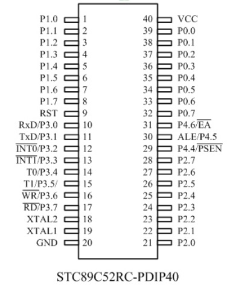

STC89C52RC-Application
======================

### Notes
- 51 series are almost identical to 52 series, 5* means different size for storing program
  - 51: 4k
  - 52: 8k
### Datasheet
- https://www.stcmcudata.com/datasheet/STC89C52.pdf

### ISP
- https://github.com/grigorig/stcgal
